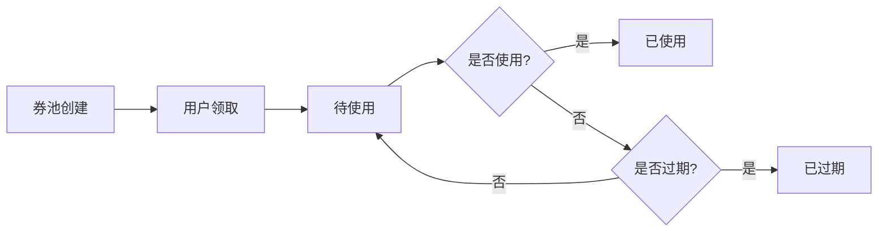
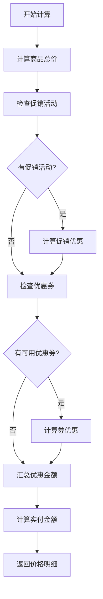
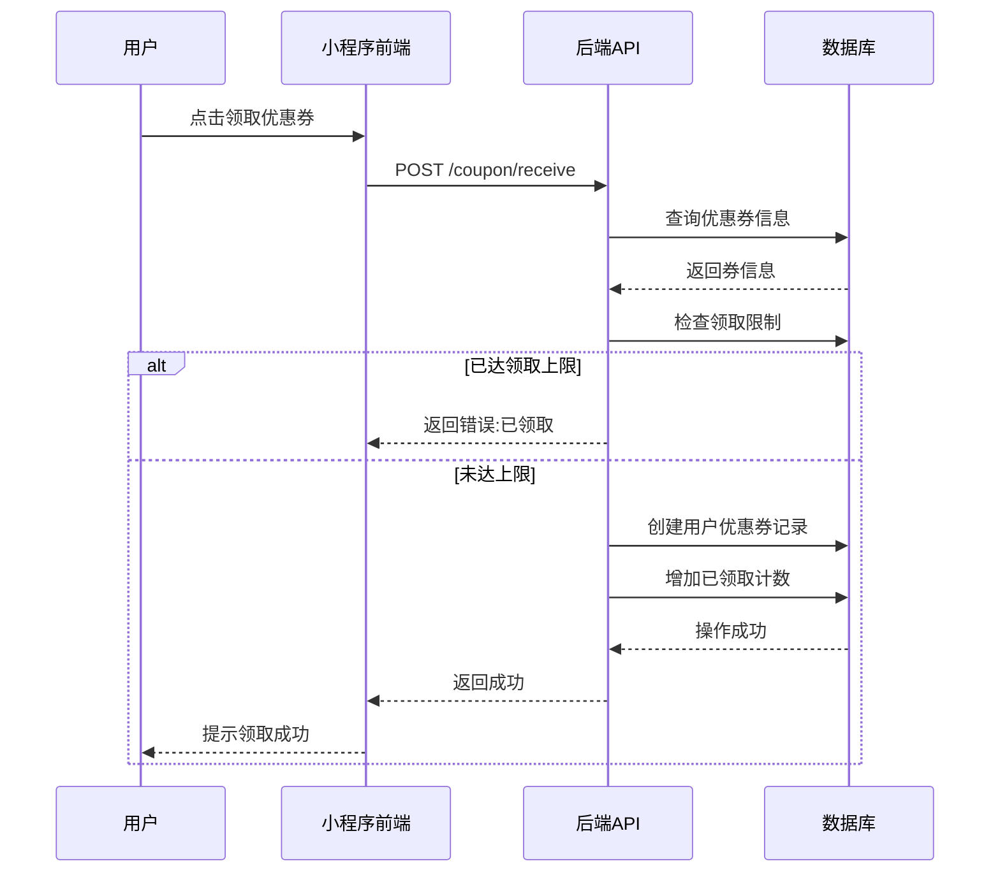
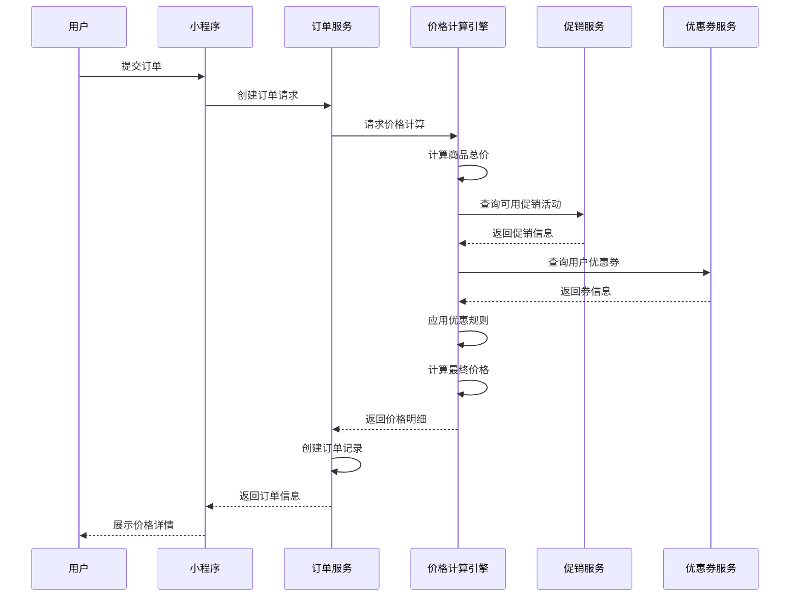
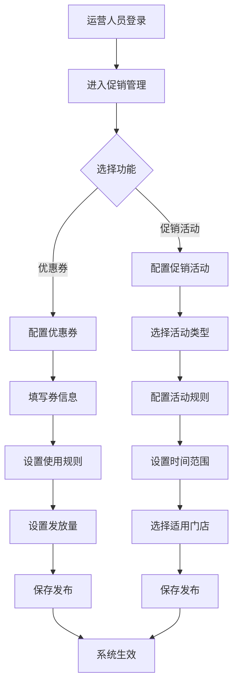
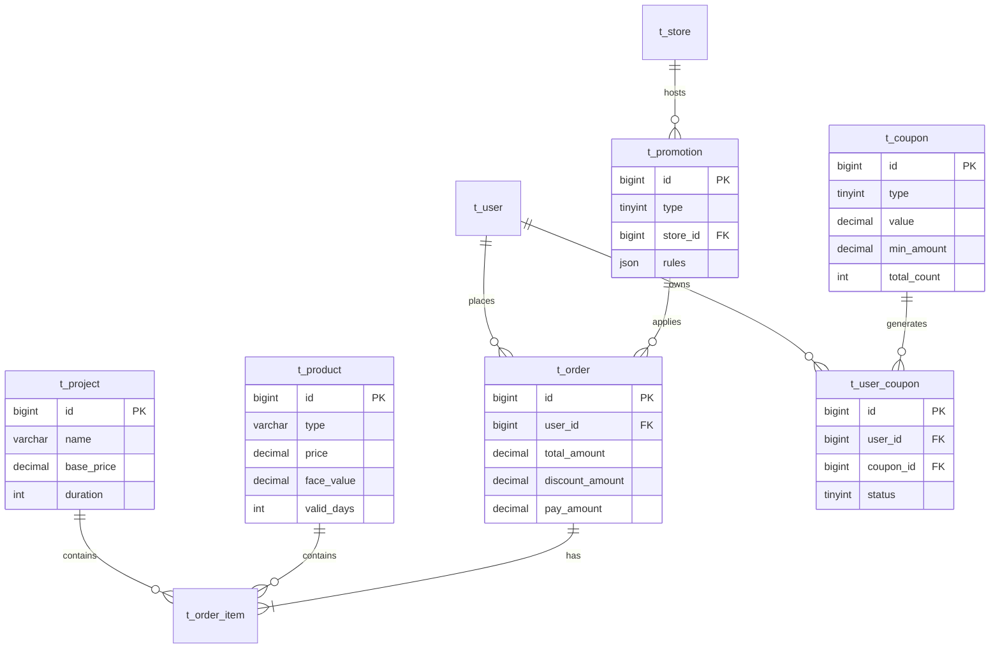

# 考拉推拿系统 - 定价与促销管理产品需求文档 (PRD)

**文档版本:** v1.0
**创建日期:** 2026-01-11
**产品经理:** Kaola Product Team
**系统架构:** 微服务架构 (Spring Cloud + 小程序前端)

---

## 📋 目录

1. [产品概述](#产品概述)
2. [核心业务模型](#核心业务模型)
3. [定价体系](#定价体系)
4. [促销活动管理](#促销活动管理)
5. [优惠券系统](#优惠券系统)
6. [价格计算引擎](#价格计算引擎)
7. [业务流程](#业务流程)
8. [数据模型详解](#数据模型详解)
9. [API接口设计](#API接口设计)
10. [前端交互设计](#前端交互设计)
11. [后台管理功能](#后台管理功能)
12. [业务规则与约束](#业务规则与约束)
13. [技术架构](#技术架构)
14. [待优化项](#待优化项)

---

## 1. 产品概述

### 1.1 业务背景

考拉推拿系统是一个O2O按摩推拿预约平台，为用户提供线上预约、线下服务的体验。定价和促销管理是核心业务能力之一，直接影响GMV、用户转化率和客单价。

### 1.2 产品目标

- **提升转化率:** 通过合理的定价策略和促销活动，提高下单转化率
- **提高客单价:** 利用满减、折扣等促销手段，引导用户购买更高价值服务
- **增强用户粘性:** 通过优惠券体系，提高用户复购率和留存率
- **灵活运营:** 支持后台灵活配置各类促销活动和定价策略

### 1.3 核心功能模块

```
定价与促销系统
├── 基础定价管理
│   ├── 服务项目定价
│   ├── 商品定价
│   └── 动态定价策略
├── 促销活动管理
│   ├── 满减活动
│   ├── 折扣活动
│   ├── 买赠活动
│   └── 秒杀活动
├── 优惠券系统
│   ├── 满减券
│   ├── 折扣券
│   ├── 代金券
│   └── 用户优惠券管理
└── 价格计算引擎
    ├── 订单价格计算
    ├── 优惠叠加规则
    └── 最终实付金额
```

---

## 2. 核心业务模型

### 2.1 商品与服务分类

考拉推拿系统主要包含三大类可售卖对象：

#### 2.1.1 **服务项目 (t_project)**
- **定义:** 用户到店消费的推拿按摩服务
- **定价方式:** 基础价格 (base_price) + 动态调整
- **时长:** 固定服务时长 (duration)
- **示例数据:**
  - 肩颈舒缓按摩: ¥198/60分钟
  - 颈椎理疗套餐: ¥298/90分钟
  - 腰背推拿: ¥218/60分钟
  - 脊柱调理套餐: ¥358/90分钟
  - 全身精油SPA: ¥398/90分钟

#### 2.1.2 **电子商品 (t_product - 电子礼卡)**
- **定义:** 可线上购买、线下核销的电子礼卡
- **字段:**
  - `price`: 售价
  - `original_price`: 原价
  - `face_value`: 面值
  - `valid_days`: 有效天数
  - `related_project_ids`: 可使用的服务项目

#### 2.1.3 **实物商品 (t_product - 周边商品)**
- **定义:** 需物流配送的实体商品
- **字段:**
  - `price`: 售价
  - `original_price`: 原价
  - `stock`: 库存
  - `sales_count`: 销量

### 2.2 价格类型说明

| 价格类型 | 字段名 | 说明 | 应用场景 |
|---------|--------|------|---------|
| **基础价格** | base_price | 服务项目的标准定价 | t_project表，作为价格计算基准 |
| **原价** | original_price | 商品划线价 | 用于展示折扣力度 |
| **售价** | price | 当前销售价格 | 实际购买价格 |
| **面值** | face_value | 礼卡可抵扣金额 | 电子礼卡特有 |
| **订单总额** | total_amount | 订单商品总价 | 未扣减任何优惠前的金额 |
| **优惠金额** | discount_amount | 优惠券/促销优惠 | 所有优惠的总和 |
| **实付金额** | pay_amount | 最终支付金额 | total_amount - discount_amount |

---

## 3. 定价体系

### 3.1 服务项目定价策略

#### 3.1.1 基础定价
```sql
-- t_project 表结构
CREATE TABLE t_project (
    id BIGINT PRIMARY KEY,
    name VARCHAR(128),
    base_price DECIMAL(10,2) NOT NULL,  -- 基础价格
    duration INT,                        -- 服务时长(分钟)
    ...
);
```

#### 3.1.2 动态定价因素 (待实现)

当前系统已预留动态定价能力，但尚未完整实现。计划支持以下因素：

| 定价因素 | 调价规则 | 优先级 | 实现状态 |
|---------|---------|--------|---------|
| **技师等级** | 初级/中级/高级/专家 分别加价 0%/10%/20%/30% | P0 | 🔴 待实现 |
| **时间段** | 高峰时段(周末/节假日)加价 10-20% | P1 | 🔴 待实现 |
| **会员等级** | 普通/银卡/金卡/钻石 享受折扣 | P1 | 🔴 待实现 |
| **门店差异** | 不同门店可自定义价格系数 | P2 | 🔴 待实现 |

**代码位置:**
- Java服务: `ProjectServiceImpl.calculatePrice()` (目前仅返回基础价格)
- VO对象: `PriceCalculationVO` (已定义字段，待填充逻辑)

### 3.2 商品定价

#### 3.2.1 电子礼卡定价逻辑
```java
// 示例：500元礼卡售价450元
{
    "type": "ELECTRONIC_CARD",
    "face_value": 500.00,     // 面值500元
    "price": 450.00,          // 售价450元
    "original_price": 500.00, // 原价500元
    "valid_days": 365         // 有效期1年
}
```

**核心规则:**
- `face_value > price`: 形成价格优势，吸引购买
- `valid_days`: 有效期管理,过期后不可使用
- `related_project_ids`: 限定可使用的服务项目

#### 3.2.2 实物商品定价
```java
{
    "type": "PHYSICAL_PRODUCT",
    "price": 299.00,
    "original_price": 399.00,
    "stock": 100,
    "sales_count": 23
}
```

---

## 4. 促销活动管理

### 4.1 促销活动类型

#### 4.1.1 数据模型 (t_promotion)

```sql
CREATE TABLE t_promotion (
    id BIGINT PRIMARY KEY,
    name VARCHAR(128) NOT NULL,          -- 活动名称
    type TINYINT NOT NULL,                -- 活动类型: 1-满减 2-折扣 3-买赠 4-秒杀
    store_id BIGINT,                      -- 适用门店 (NULL表示全场)
    start_time DATETIME NOT NULL,         -- 开始时间
    end_time DATETIME NOT NULL,           -- 结束时间
    rules JSON,                           -- 规则配置(JSON)
    status TINYINT DEFAULT 1,             -- 状态: 0-禁用 1-启用
    ...
);
```

#### 4.1.2 活动类型详解

**Type 1: 满减活动**
```json
{
    "type": 1,
    "name": "新用户首单立减",
    "rules": {
        "minAmount": 200,           // 最低消费金额
        "discountAmount": 50,       // 优惠金额
        "limitPerUser": 1,          // 每用户限用次数
        "description": "新用户首次下单满200减50"
    }
}
```

**示例数据:**
- 新用户首单立减: 满200减50
- 满300减50活动: 朝阳大悦城店专享

**Type 2: 折扣活动**
```json
{
    "type": 2,
    "name": "全场8折优惠",
    "rules": {
        "discount": 0.8,            // 折扣率
        "maxDiscount": 100,         // 最高优惠金额上限
        "description": "全场8折，最高优惠100元"
    }
}
```

**Type 3: 买赠活动** (待实现)
```json
{
    "type": 3,
    "rules": {
        "buyProducts": [1, 2],      // 购买商品ID
        "giftProducts": [3],        // 赠送商品ID
        "buyQuantity": 1,           // 购买数量
        "giftQuantity": 1           // 赠送数量
    }
}
```

**Type 4: 秒杀活动** (待实现)
```json
{
    "type": 4,
    "rules": {
        "productId": 1,
        "originalPrice": 298,
        "seckillPrice": 199,
        "stock": 100,
        "limitPerUser": 1
    }
}
```

### 4.2 促销活动作用域

| 作用域 | store_id | 说明 | 示例 |
|--------|----------|------|------|
| **全场活动** | NULL | 所有门店可用 | "全场8折优惠" |
| **单店活动** | 具体门店ID | 仅指定门店可用 | "朝阳大悦城店满300减50" |

### 4.3 活动有效期管理

- **预热期:** start_time之前,活动"即将开始"
- **进行中:** start_time ~ end_time之间,活动"进行中"
- **已结束:** 超过end_time,活动"已结束"

**前端展示逻辑:**
```javascript
// miniprogram-user/pages/promotion/index.js
const now = new Date();
const isActive = now >= promotion.start_time && now <= promotion.end_time;
const remainingTime = promotion.end_time - now; // 剩余时间
```

---

## 5. 优惠券系统

### 5.1 优惠券数据模型

#### 5.1.1 优惠券主表 (t_coupon)

```sql
CREATE TABLE t_coupon (
    id BIGINT PRIMARY KEY,
    name VARCHAR(128) NOT NULL,          -- 优惠券名称
    type TINYINT NOT NULL,                -- 类型: 1-满减券 2-折扣券 3-代金券
    value DECIMAL(10,2) NOT NULL,         -- 优惠值(金额或折扣)
    min_amount DECIMAL(10,2) DEFAULT 0,   -- 使用门槛(最低消费)
    start_time DATETIME NOT NULL,         -- 有效期开始
    end_time DATETIME NOT NULL,           -- 有效期结束
    total_count INT NOT NULL,             -- 发放总量
    used_count INT DEFAULT 0,             -- 已使用数量
    rules JSON,                           -- 扩展规则
    status TINYINT DEFAULT 1,             -- 状态: 0-禁用 1-启用
    ...
);
```

#### 5.1.2 用户优惠券表 (t_user_coupon)

```sql
CREATE TABLE t_user_coupon (
    id BIGINT PRIMARY KEY,
    user_id BIGINT NOT NULL,              -- 用户ID
    coupon_id BIGINT NOT NULL,            -- 优惠券ID
    status TINYINT DEFAULT 0,             -- 0-未使用 1-已使用 2-已过期
    use_time DATETIME,                    -- 使用时间
    order_id BIGINT,                      -- 关联订单ID
    ...
);
```

### 5.2 优惠券类型详解

#### Type 1: 满减券
```json
{
    "id": 2,
    "name": "满200减30券",
    "type": 1,
    "value": 30.00,                 // 减30元
    "min_amount": 200.00,           // 满200可用
    "total_count": 5000,
    "used_count": 890,
    "rules": {
        "description": "满200元可用，全场通用"
    }
}
```

**计算公式:** `优惠金额 = value` (当订单金额 >= min_amount 时)

#### Type 2: 折扣券 (待完善)
```json
{
    "name": "全场9折券",
    "type": 2,
    "value": 0.9,                   // 9折
    "min_amount": 0,
    "rules": {
        "maxDiscount": 50,          // 最高优惠50元
        "description": "全场9折，最高优惠50元"
    }
}
```

**计算公式:** `优惠金额 = MIN(订单金额 * (1 - value), maxDiscount)`

#### Type 3: 代金券 (无门槛券)
```json
{
    "id": 1,
    "name": "新人专享50元券",
    "type": 3,
    "value": 50.00,                 // 抵扣50元
    "min_amount": 0.00,             // 无门槛
    "total_count": 10000,
    "used_count": 1250,
    "rules": {
        "isNewUser": true,          // 仅新用户可用
        "description": "新用户注册即送50元代金券"
    }
}
```

### 5.3 优惠券生命周期



**状态说明:**
- **待使用 (status=0):** 用户已领取,未使用,未过期
- **已使用 (status=1):** 用户已使用,关联订单ID
- **已过期 (status=2):** 超过有效期,自动过期

### 5.4 优惠券业务规则

| 规则项 | 说明 | 实现方式 |
|--------|------|---------|
| **领取限制** | 每个优惠券限领N张 | `UserCouponRepository.countByUserIdAndCouponId()` |
| **使用条件** | 满足最低消费金额 | `coupon.min_amount <= order.total_amount` |
| **有效期** | 在开始和结束时间内 | `now >= start_time && now <= end_time` |
| **库存控制** | 总发放量限制 | `used_count < total_count` |
| **互斥规则** | 一单只能用一张券 | 前端选择逻辑 + 后端校验 |
| **新人专享** | 仅新注册用户可用 | `rules.isNewUser = true` 校验 |

---

## 6. 价格计算引擎

### 6.1 订单价格计算流程



### 6.2 价格计算公式

#### 6.2.1 基础计算
```java
// 订单总额
total_amount = Σ(商品单价 × 数量)

// 优惠金额
discount_amount = 促销优惠 + 优惠券优惠

// 实付金额
pay_amount = total_amount - discount_amount
```

#### 6.2.2 促销优惠计算

**满减活动:**
```java
if (total_amount >= promotion.rules.minAmount) {
    promotion_discount = promotion.rules.discountAmount;
}
```

**折扣活动:**
```java
discount = total_amount * (1 - promotion.rules.discount);
promotion_discount = Math.min(discount, promotion.rules.maxDiscount);
```

#### 6.2.3 优惠券优惠计算

**满减券:**
```java
if (total_amount >= coupon.min_amount) {
    coupon_discount = coupon.value;
}
```

**折扣券:**
```java
if (total_amount >= coupon.min_amount) {
    discount = total_amount * (1 - coupon.value);
    coupon_discount = Math.min(discount, coupon.rules.maxDiscount);
}
```

**代金券:**
```java
coupon_discount = Math.min(coupon.value, total_amount);
```

### 6.3 优惠叠加规则

**当前策略:** 促销活动与优惠券 **互斥** (一单只能选一种)

**未来可扩展策略:**
- **叠加模式:** 促销 + 优惠券可同时使用
- **最优选择:** 系统自动选择最优惠组合
- **分级叠加:** 不同级别优惠可叠加(如:满减+折扣+代金券)

### 6.4 价格计算数据结构

#### 6.4.1 价格查询请求 (PriceQueryDTO)
```java
public class PriceQueryDTO {
    private Long projectId;      // 项目ID
    private Long masseurId;      // 技师ID
    private Long storeId;        // 门店ID
    private LocalDate date;      // 预约日期
    private LocalTime time;      // 预约时间
}
```

#### 6.4.2 价格计算结果 (PriceCalculationVO)
```java
public class PriceCalculationVO {
    private Long projectId;
    private String projectName;
    private BigDecimal basePrice;        // 基础价格
    private BigDecimal originalPrice;    // 原价
    private BigDecimal finalPrice;       // 最终价格
    private BigDecimal actualPrice;      // 实际支付价
    private BigDecimal discountAmount;   // 优惠金额
    private String discountReason;       // 优惠原因说明
    private Integer masseurLevel;        // 技师等级
    private String timeSlotType;         // 时间段类型
}
```

---

## 7. 业务流程

### 7.1 优惠券领取流程



**关键校验点:**
1. 优惠券是否存在且启用
2. 是否在有效期内
3. 库存是否充足 (`used_count < total_count`)
4. 用户是否已达领取上限
5. 新人专享券需校验用户身份

### 7.2 订单价格计算流程



### 7.3 后台促销配置流程



---

## 8. 数据模型详解

### 8.1 核心表结构关系



### 8.2 订单表价格字段说明

```sql
CREATE TABLE t_order (
    id BIGINT PRIMARY KEY,
    order_no VARCHAR(32) UNIQUE,          -- 订单编号
    user_id BIGINT NOT NULL,               -- 用户ID
    store_id BIGINT,                       -- 门店ID

    -- 价格字段
    total_amount DECIMAL(10,2) NOT NULL,   -- 订单总额(优惠前)
    discount_amount DECIMAL(10,2) DEFAULT 0, -- 优惠金额
    pay_amount DECIMAL(10,2) NOT NULL,     -- 实付金额

    status TINYINT DEFAULT 1,              -- 订单状态
    pay_method TINYINT,                    -- 支付方式
    pay_time DATETIME,                     -- 支付时间
    order_type VARCHAR(20) DEFAULT 'SERVICE', -- 订单类型
    ...
);
```

**价格字段关系:**
```
total_amount = Σ(订单明细金额)
pay_amount = total_amount - discount_amount
discount_amount = 促销优惠 + 优惠券优惠
```

---

## 9. API接口设计

### 9.1 C端用户接口

#### 9.1.1 促销活动接口

**获取促销活动列表**
```http
GET /promotion/list?storeId=1&type=1
```

**Response:**
```json
{
    "code": 200,
    "data": [
        {
            "id": 1,
            "name": "新用户首单立减",
            "type": 1,
            "description": "新用户首次下单满200减50",
            "startTime": "2024-01-01 00:00:00",
            "endTime": "2024-12-31 23:59:59",
            "isActive": true,
            "remainingTime": 86400000
        }
    ]
}
```

#### 9.1.2 优惠券接口

**获取可用优惠券**
```http
GET /coupon/available?userId=1
```

**领取优惠券**
```http
POST /coupon/receive
Content-Type: application/json

{
    "userId": 1,
    "couponId": 2
}
```

**Response:**
```json
{
    "code": 200,
    "message": "领取成功",
    "data": {
        "userCouponId": 123,
        "couponName": "满200减30券",
        "expireTime": "2024-12-31 23:59:59"
    }
}
```

**使用优惠券**
```http
POST /coupon/apply
Content-Type: application/json

{
    "userCouponId": 123,
    "orderId": 456
}
```

### 9.2 B端管理接口

#### 9.2.1 优惠券管理

**优惠券列表(分页)**
```http
GET /admin/coupon/list?page=1&size=10&type=1&status=1
```

**创建优惠券**
```http
POST /admin/coupon/create
Content-Type: application/json

{
    "name": "满200减30券",
    "type": 1,
    "value": 30.00,
    "minAmount": 200.00,
    "startTime": "2024-01-01 00:00:00",
    "endTime": "2024-12-31 23:59:59",
    "totalCount": 5000,
    "rules": {
        "description": "满200元可用，全场通用"
    },
    "status": 1
}
```

**更新优惠券状态**
```http
PUT /admin/coupon/updateStatus
Content-Type: application/json

{
    "id": 2,
    "status": 0
}
```

#### 9.2.2 促销活动管理

**促销活动列表**
```http
GET /admin/promotion/list?page=1&size=10&type=1
```

**创建促销活动**
```http
POST /admin/promotion/create
Content-Type: application/json

{
    "name": "全场8折优惠",
    "type": 2,
    "storeId": null,
    "startTime": "2024-03-01 00:00:00",
    "endTime": "2024-03-31 23:59:59",
    "rules": {
        "discount": 0.8,
        "maxDiscount": 100,
        "description": "全场8折，最高优惠100元"
    },
    "status": 1
}
```

---

## 10. 前端交互设计

### 10.1 小程序用户端

#### 10.1.1 优惠券页面 (/pages/coupon/index)

**功能要点:**
- Tab切换: 待使用/已使用/已过期
- 优惠券卡片展示:
  - 面额/折扣
  - 使用条件 (如: 满200可用)
  - 有效期
  - "立即使用"按钮

**当前状态:**
```javascript
// miniprogram-user/pages/coupon/index.js
data: {
    activeTab: 0,  // 0-待使用 1-已使用 2-已过期
    coupons: []    // Mock数据,待接入API
}
```

#### 10.1.2 促销页面 (/pages/promotion/index)

**页面内容:**
- 电子礼卡列表
- 项目礼卡列表
- 周边商品列表

**价格展示:**
```javascript
// 展示原价和售价
<view class="original-price">¥{{item.originalPrice}}</view>
<view class="price">¥{{item.price}}</view>
<view class="face-value">面值¥{{item.faceValue}}</view>
```

#### 10.1.3 订单确认页面 (待完善)

**价格明细展示:**
```
商品总额: ¥398.00
促销优惠: -¥50.00
优惠券: -¥30.00
--------------------
实付金额: ¥318.00
```

### 10.2 后台管理端 (admin-web)

#### 10.2.1 优惠券列表页 (/pages/Promotion/CouponList)

**功能:**
- 列表展示: 券名/类型/面值/使用门槛/发放进度/有效期/状态
- 搜索筛选: 按券名搜索
- 操作按钮: 新建/编辑/删除/启用禁用

**关键代码:**
```typescript
// admin-web/src/pages/Promotion/CouponList.tsx
const columns = [
    { title: '优惠券名称', dataIndex: 'name' },
    { title: '类型', render: (type) => couponTypeMap[type] },
    { title: '面值/折扣', dataIndex: 'value' },
    { title: '使用门槛', dataIndex: 'minAmount' },
    { title: '发放进度', render: (_, record) =>
        `${record.usedCount}/${record.totalCount}`
    },
    ...
];
```

#### 10.2.2 优惠券编辑页 (/pages/Promotion/CouponEdit)

**表单字段:**
- 基础信息: 优惠券名称
- 类型选择: 满减券/折扣券/无门槛券
- 优惠设置:
  - 面值/折扣 (根据类型动态显示)
  - 使用门槛 (最低消费金额)
- 发放设置:
  - 发放总量
  - 有效期 (开始时间~结束时间)
- 状态: 启用/禁用

#### 10.2.3 促销活动列表页 (/pages/Promotion/PromotionList)

**功能:**
- 列表展示: 活动名称/类型/优惠力度/最低消费/时间范围/状态
- 活动类型映射:
  - 1: 满减
  - 2: 折扣
  - 3: 秒杀

#### 10.2.4 促销活动编辑页 (/pages/Promotion/PromotionEdit)

**表单字段:**
- 活动名称
- 活动类型 (满减/折扣/秒杀)
- 优惠设置 (根据类型动态显示):
  - 满减: 优惠金额 + 最低消费
  - 折扣: 折扣力度 + 最大优惠金额
- 时间设置: 开始时间 ~ 结束时间
- 描述
- 状态

---

## 11. 后台管理功能

### 11.1 权限控制

**菜单权限配置:**
```sql
-- admin-init.sql
-- 促销管理菜单
INSERT INTO t_admin_menu (name, path, permission) VALUES
('促销管理', '/promotion', 'promotion:view'),
('优惠券管理', '/promotion/coupon', 'promotion:coupon:manage'),
('活动管理', '/promotion/activity', 'promotion:activity:manage');
```

### 11.2 数据统计 (待实现)

**优惠券统计:**
- 发放总量 vs 使用量
- 使用率
- 券类型分布
- 热门优惠券TOP10

**促销活动效果:**
- 活动期间GMV
- 订单量增长
- 客单价变化
- 活动ROI

---

## 12. 业务规则与约束

### 12.1 优惠叠加规则

**当前策略:**
- ❌ 促销活动与优惠券 **不可叠加**
- ✅ 一个订单只能使用 **一张优惠券**
- ✅ 一个订单只能参与 **一个促销活动**

**选择逻辑:**
```java
// 伪代码
if (用户选择了优惠券) {
    计算优惠券优惠;
} else if (订单满足促销活动条件) {
    计算促销优惠;
}
```

**未来扩展:**
可配置叠加策略,如:
- 促销 + 券可叠加
- 自动选择最优方案
- 分层优惠叠加

### 12.2 优惠券使用限制

| 限制类型 | 规则 | 校验方式 |
|---------|------|---------|
| **最低消费** | 订单金额 >= min_amount | 下单时校验 |
| **有效期** | 当前时间在 start_time ~ end_time 内 | 领取和使用时校验 |
| **库存** | used_count < total_count | 领取时校验 |
| **单次使用** | 一张券只能用一次 | 数据库约束 |
| **用户限领** | 同一券每用户限领N张 | rules.limitPerUser |
| **新人专享** | isNewUser = true | rules.isNewUser |

### 12.3 促销活动互斥规则

**场景: 同一商品参与多个活动**
- 优先级: 活动优惠 > 优惠券优惠
- 选择策略: 用户手动选择 or 系统自动选择最优

**场景: 不同门店活动**
- 全场活动 vs 单店活动: 单店活动优先级更高

---

## 13. 技术架构

### 13.1 系统架构图

```
┌─────────────────────────────────────────────────────┐
│                   用户端 (小程序)                    │
│  - 优惠券页面                                        │
│  - 促销活动页面                                      │
│  - 订单确认页面                                      │
└──────────────────┬──────────────────────────────────┘
                   │ API调用
┌──────────────────┴──────────────────────────────────┐
│              API Gateway (8090)                      │
└──────────────────┬──────────────────────────────────┘
                   │ 路由转发
    ┌──────────────┼──────────────┬──────────────┐
    │              │               │              │
┌───▼────┐  ┌─────▼──────┐  ┌────▼─────┐  ┌────▼─────┐
│Marketing│  │Order       │  │User      │  │Product   │
│Service  │  │Service     │  │Service   │  │Service   │
│(8092)   │  │(8086)      │  │(8081)    │  │(8085)    │
│         │  │            │  │          │  │          │
│- 促销管理│  │- 订单创建  │  │- 用户信息│  │- 商品管理│
│- 优惠券  │  │- 价格计算  │  │- 券领取  │  │- 项目管理│
└─────────┘  └────────────┘  └──────────┘  └──────────┘
    │              │               │              │
    └──────────────┴───────────────┴──────────────┘
                   │
            ┌──────▼──────┐
            │   MySQL     │
            │ kaola_massage│
            │             │
            │- t_coupon   │
            │- t_promotion│
            │- t_order    │
            │- t_product  │
            └─────────────┘

┌─────────────────────────────────────────────────────┐
│              管理后台 (admin-web)                    │
│  - 优惠券管理                                        │
│  - 促销活动管理                                      │
└─────────────────────────────────────────────────────┘
```

### 13.2 技术栈

**后端:**
- Spring Boot 3.2.0
- Spring Cloud (Nacos服务发现)
- MyBatis-Plus 3.5.7
- MySQL 8.0
- Redis (缓存)

**前端:**
- 小程序: 微信小程序原生开发
- 后台: React 18 + Ant Design + TypeScript

### 13.3 关键服务

| 服务名 | 端口 | 职责 | 相关表 |
|--------|------|------|--------|
| **marketing-service** | 8092 | 营销促销管理 | t_coupon, t_user_coupon, t_promotion |
| **order-service** | 8086 | 订单管理 | t_order, t_order_item |
| **product-service** | 8085 | 商品管理 | t_product, t_project |
| **user-service** | 8081 | 用户管理 | t_user |
| **gateway** | 8090 | API网关 | - |

---

## 14. 待优化项

### 14.1 高优先级 (P0)

#### 14.1.1 **价格计算引擎完善**
**现状:**
- `ProjectServiceImpl.calculatePrice()` 仅返回基础价格
- 缺少技师等级、时间段等动态定价因素

**改进方案:**
```java
// ProjectServiceImpl.java
public PriceCalculationVO calculatePrice(PriceQueryDTO query) {
    Project project = getById(query.getProjectId());
    BigDecimal basePrice = project.getBasePrice();

    // 技师等级加价
    BigDecimal masseurFee = calculateMasseurLevelFee(query.getMasseurId());

    // 时间段加价
    BigDecimal timeFee = calculateTimeSlotFee(query.getDate(), query.getTime());

    // 会员折扣
    BigDecimal memberDiscount = calculateMemberDiscount(query.getUserId());

    BigDecimal finalPrice = basePrice + masseurFee + timeFee - memberDiscount;

    return PriceCalculationVO.builder()
        .basePrice(basePrice)
        .finalPrice(finalPrice)
        .discountAmount(memberDiscount)
        .build();
}
```

#### 14.1.2 **促销服务实现**
**现状:**
- `PromotionServiceImpl` 为空实现，返回空列表/true

**待实现:**
```java
@Override
public List<PromotionVO> getActivePromotions(Long storeId) {
    // 查询当前有效的促销活动
    return promotionRepository.findActivePromotions(storeId, LocalDateTime.now());
}

@Override
public List<CouponVO> getAvailableCoupons(Long userId) {
    // 查询用户可用优惠券
    return userCouponRepository.findAvailableByUserId(userId);
}
```

#### 14.1.3 **优惠叠加策略引擎**
**需求:**
- 支持配置化的优惠叠加规则
- 自动计算最优优惠组合

**方案:**
```java
public class DiscountEngine {
    public DiscountResult calculateBestDiscount(
        Order order,
        List<Promotion> promotions,
        List<UserCoupon> coupons
    ) {
        // 计算所有可能的优惠组合
        // 返回最优方案
    }
}
```

### 14.2 中优先级 (P1)

#### 14.2.1 **会员等级体系**
- 普通/银卡/金卡/钻石会员
- 不同等级享受不同折扣
- 积分兑换优惠券

#### 14.2.2 **动态定价时间段配置**
- 高峰时段(周末/节假日)加价
- 低峰时段折扣促销

#### 14.2.3 **买赠/秒杀活动实现**
- 完善Type=3(买赠)和Type=4(秒杀)的业务逻辑
- 秒杀库存管理(Redis)

### 14.3 低优先级 (P2)

#### 14.3.1 **促销效果分析**
- 活动ROI统计
- 优惠券使用率分析
- A/B测试支持

#### 14.3.2 **个性化推荐**
- 基于用户画像推荐优惠券
- 智能推荐促销活动

#### 14.3.3 **多门店差异化定价**
- 不同城市/门店价格系数
- 动态调价策略

---

## 15. 总结

### 15.1 当前完成度

| 模块 | 完成度 | 说明 |
|------|--------|------|
| **基础定价** | 70% | 服务项目基础价格已实现，动态定价待完善 |
| **商品定价** | 90% | 电子礼卡、实物商品定价完整 |
| **促销活动** | 60% | 数据模型完整，业务逻辑部分待实现 |
| **优惠券系统** | 70% | 数据模型完整，核心流程待完善 |
| **价格计算** | 40% | 基础框架搭建，复杂规则待实现 |
| **前端页面** | 80% | 展示页面完整，交互逻辑待优化 |
| **后台管理** | 85% | CRUD功能完整，数据统计待补充 |

### 15.2 核心价值

1. **灵活的定价策略:** 支持基础定价+动态调价
2. **完善的促销体系:** 满减/折扣/买赠/秒杀多种活动类型
3. **精细的优惠券管理:** 三种券型+丰富的使用规则
4. **可扩展的计算引擎:** 支持复杂的优惠叠加逻辑
5. **便捷的后台管理:** 运营人员可快速配置活动

### 15.3 下一步行动

**短期(1-2周):**
1. 完善 `PromotionServiceImpl` 业务逻辑
2. 实现优惠券领取和使用完整流程
3. 完成订单价格计算引擎

**中期(1个月):**
1. 实现技师等级、时间段动态定价
2. 完善优惠叠加策略
3. 补充促销效果数据统计

**长期(2-3个月):**
1. 会员等级体系建设
2. 个性化推荐引擎
3. A/B测试平台

---

**文档维护:** 本文档随产品迭代持续更新
**反馈渠道:** Kaola Product Team
**最后更新:** 2026-01-11
