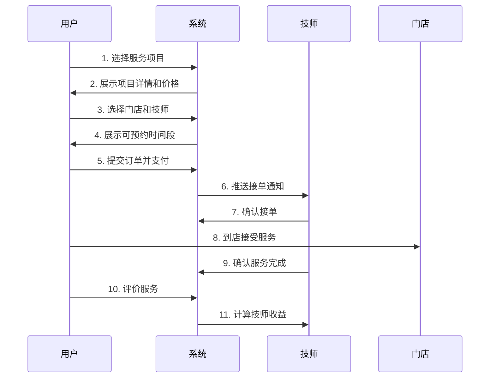

# 考拉推拿预约系统 - 产品功能说明书

## 📋 文档信息
- **产品名称**：考拉推拿预约系统
- **版本号**：v1.0.0
- **最后更新**：2025-12-11
- **目标用户**：产品经理、运营团队、业务人员
- **文档目的**：全面介绍系统功能架构、业务流程和运营能力

---

## 🎯 产品定位与价值

### 产品定位
考拉推拿预约系统是一个面向推拿按摩行业的**全渠道数字化运营平台**，为连锁门店提供线上预约、技师管理、订单管理、营销推广等一体化解决方案。

### 核心价值
1. **用户端**：便捷的线上预约体验，透明的服务信息，灵活的优惠活动
2. **门店端**：智能排班调度，高效订单管理，精准数据分析
3. **技师端**：清晰的工作安排，透明的收入管理，专业的绩效评估
4. **管理端**：全面的运营数据，精细化的业务管控，智能化的决策支持

---

## 🏗️ 系统架构概览

### 系统组成
系统采用**前后端分离 + 微服务架构**，由以下部分组成：

```
┌─────────────────────────────────────────────────────────┐
│                     用户访问层                            │
│  ┌──────────┐  ┌──────────┐  ┌──────────┐  ┌──────────┐│
│  │ 移动端H5 │  │ 小程序   │  │ 管理后台 │  │  APP    ││
│  └──────────┘  └──────────┘  └──────────┘  └──────────┘│
└─────────────────────────────────────────────────────────┘
                           ▼
┌─────────────────────────────────────────────────────────┐
│                      API网关层                            │
│              统一路由、认证鉴权、限流熔断                   │
└─────────────────────────────────────────────────────────┘
                           ▼
┌─────────────────────────────────────────────────────────┐
│                    业务服务层                             │
│  ┌────────┐ ┌────────┐ ┌────────┐ ┌────────┐           │
│  │用户服务│ │门店服务│ │订单服务│ │营销服务│ ...       │
│  └────────┘ └────────┘ └────────┘ └────────┘           │
└─────────────────────────────────────────────────────────┘
                           ▼
┌─────────────────────────────────────────────────────────┐
│                    数据存储层                             │
│       MySQL数据库 + Redis缓存 + 文件存储                  │
└─────────────────────────────────────────────────────────┘
```

### 微服务模块
系统共包含 **10个核心微服务**：

| 服务名称 | 端口 | 业务职责 |
|---------|------|---------|
| 用户服务 | 8082 | 用户注册登录、权限角色管理 |
| 门店服务 | 8083 | 门店信息、技师档案管理 |
| 订单服务 | 8086 | 预约订单、服务流程管理 |
| 产品服务 | 8085 | 服务项目、分类管理 |
| 排班服务 | 8091 | 技师排班、请假审批 |
| 营销服务 | 8092 | 促销活动、优惠券管理 |
| 评价服务 | 8093 | 用户评价、回复管理 |
| 投诉服务 | 8094 | 投诉处理、客诉管理 |
| 财务服务 | 8096 | 技师提现、收益管理 |
| 管理服务 | 8095 | 数据统计、系统设置 |

---

## 📱 管理后台功能详解

### 一、数据看板 Dashboard

#### 1.1 功能概述
提供实时的业务数据监控和趋势分析，帮助管理者快速了解经营状况。

#### 1.2 核心功能
- **实时数据卡片**
  - 今日订单数量
  - 今日营业额
  - 活跃用户数
  - 技师在岗人数

- **趋势分析图表**
  - 近7天订单趋势
  - 近30天营收趋势
  - 门店业绩对比
  - 技师服务量排名

#### 1.3 应用场景
- 每日晨会查看前一天业绩
- 周/月度经营分析会议
- 实时监控异常数据（如订单量骤降）

---

### 二、门店管理 Store Management

#### 2.1 门店信息管理

**功能列表**：
- ✅ 门店列表展示（支持分页、搜索）
- ✅ 新增门店
- ✅ 编辑门店信息
- ✅ 启用/禁用门店
- ✅ 删除门店（逻辑删除）

**核心信息字段**：
- 基础信息：门店名称、地址、联系电话、营业时间
- 位置信息：省市区、详细地址、经纬度坐标
- 展示信息：门店图片（支持多图）、门店介绍
- 状态信息：营业状态、排序权重

**业务规则**：
- 禁用的门店不在用户端展示
- 删除门店时需检查是否有关联技师/订单
- 门店图片限制：最多5张，单张不超过2MB

#### 2.2 服务区域管理

**功能说明**：
- 定义门店的服务覆盖范围
- 支持多个区域配置
- 自动计算门店距离用户的距离

**应用场景**：
- 用户下单时推荐最近的门店
- 限制门店的服务接单范围

---

### 三、技师管理 Masseur Management

#### 3.1 技师档案管理

**功能列表**：
- ✅ 技师列表（支持按门店、状态筛选）
- ✅ 新增技师
- ✅ 编辑技师信息
- ✅ 技师认证审核
- ✅ 启用/禁用技师
- ✅ 查看技师详情

**核心信息**：
- 个人信息：姓名、性别、手机号、头像
- 专业信息：工龄、擅长项目、技师等级
- 资质证书：证书照片、证书编号、发证机构
- 门店归属：所属门店、入职时间
- 展示信息：技师照片、个人简介、服务特长

**状态管理**：
- 待认证：新注册等待审核
- 已认证：通过审核可接单
- 已禁用：违规暂停服务
- 已离职：不再提供服务

**业务流程**：
```
技师注册 → 提交资料 → 后台审核 → 审核通过 → 可接单
                ↓
           审核不通过 → 修改资料 → 重新审核
```

#### 3.2 技师评级管理

**评级体系**：
- 初级技师：0-6个月工龄
- 中级技师：6-24个月工龄
- 高级技师：24-60个月工龄
- 特级技师：60个月以上工龄

**评级用途**：
- 影响服务定价
- 展示专业程度
- 用户筛选参考

---

### 四、服务项目管理 Project Management

#### 4.1 项目分类管理

**功能说明**：
- 创建服务分类（如：肩颈按摩、足疗、全身推拿）
- 分类排序（控制展示顺序）
- 分类启用/禁用
- 分类图标上传

**典型分类示例**：
- 中式推拿
- 泰式按摩
- 日式按摩
- 足底按摩
- 刮痧拔罐

#### 4.2 服务项目管理

**功能列表**：
- ✅ 项目列表管理
- ✅ 新增/编辑项目
- ✅ 项目上下架
- ✅ 价格设置
- ✅ 项目详情配置

**项目信息**：
- 基础信息：项目名称、分类、服务时长
- 价格信息：原价、会员价、折扣价
- 展示信息：项目图片、详细介绍、适用人群
- 库存信息：每日可预约数量

**定价策略**：
- 支持不同门店差异化定价
- 支持不同技师等级差异化定价
- 支持活动期间临时调价

---

### 五、订单管理 Order Management

#### 5.1 订单列表

**筛选维度**：
- 订单状态：待支付、待服务、服务中、已完成、已取消
- 时间范围：今日、本周、本月、自定义
- 门店筛选：全部门店、指定门店
- 技师筛选：全部技师、指定技师
- 用户搜索：手机号、姓名

**列表展示信息**：
- 订单编号（支持复制）
- 预约时间
- 用户信息
- 服务项目
- 技师信息
- 订单金额
- 订单状态

#### 5.2 订单详情

**详细信息**：
- 用户信息：姓名、手机号、地址
- 预约信息：服务日期、时间段、门店地址
- 服务信息：项目名称、服务时长、技师姓名
- 支付信息：订单金额、优惠金额、实付金额、支付方式
- 操作记录：下单时间、支付时间、服务时间、完成时间

#### 5.3 订单操作

**可执行操作**：
- 确认服务（技师开始服务）
- 完成服务（结束服务）
- 取消订单（特殊情况）
- 退款处理
- 修改订单（调整时间/技师）

**取消规则**：
- 提前2小时以上：全额退款
- 2小时内：扣除30%违约金
- 已服务：不可取消

---

### 六、排班管理 Schedule Management

#### 6.1 技师排班

**排班视图**：
- 日历视图：按月份展示每日排班
- 列表视图：按技师展示排班明细
- 时间段视图：按时间段展示可用技师

**排班操作**：
- 单次排班：为单个技师设置某天的班次
- 批量排班：为多个技师设置多天的班次
- 班次模板：保存常用排班模板快速应用
- 复制排班：将上周排班复制到本周

**班次类型**：
- 早班：08:00-16:00
- 晚班：16:00-24:00
- 全天班：08:00-24:00
- 休息：不排班

**排班规则**：
- 每位技师每天最多排一个班次
- 请假期间不可排班
- 已有订单的时段不可修改

#### 6.2 请假管理

**请假流程**：
```
技师提交请假申请 → 运营审批 → 审批结果通知
```

**请假类型**：
- 事假
- 病假
- 年假
- 调休

**审批操作**：
- 查看请假列表（待审批、已审批）
- 查看请假详情（技师、时间、原因）
- 批准请假
- 拒绝请假（需填写拒绝原因）

**业务规则**：
- 请假需提前1天申请
- 请假期间自动取消已有排班
- 已有订单的时段不可请假（需先取消订单或调整技师）

---

### 七、营销管理 Marketing Management

#### 7.1 促销活动管理

**活动类型**：
- 限时折扣：指定时间段内项目打折
- 满减活动：满XX元减XX元
- 新人专享：首次下单优惠
- 会员专属：会员用户特殊优惠

**活动配置**：
- 活动名称、活动时间
- 适用范围（门店、项目、用户群体）
- 优惠规则（折扣率、满减金额）
- 活动预算（总金额、每日限额）
- 限制条件（每人限用次数）

**活动状态**：
- 未开始：已创建但未到开始时间
- 进行中：活动时间内
- 已结束：超过结束时间
- 已停用：手动停止

#### 7.2 优惠券管理

**优惠券类型**：
- 满减券：满XX减XX
- 折扣券：打X折
- 代金券：直接抵扣

**发放方式**：
- 系统发放：批量发放给指定用户群
- 用户领取：用户主动领取
- 下单赠送：完成订单后赠送

**优惠券配置**：
- 基础信息：券名称、券面额、有效期
- 使用规则：最低消费、适用项目
- 发放设置：发放数量、每人限领
- 生效时间：立即生效/延迟生效

---

### 八、评价管理 Review Management

#### 8.1 评价列表

**查看维度**：
- 按门店查看
- 按技师查看
- 按时间筛选
- 按评分筛选（5星、4星...）

**评价信息**：
- 用户昵称（脱敏处理）
- 订单信息
- 评分星级
- 评价内容
- 评价图片
- 评价时间

#### 8.2 评价管理

**管理操作**：
- 查看评价详情
- 回复用户评价
- 隐藏不当评价
- 删除违规评价

**回复规范**：
- 24小时内回复
- 使用标准话术模板
- 对负面评价进行安抚和解决方案

**评价展示规则**：
- 好评优先展示
- 有图片评价权重高
- 最新评价优先

---

### 九、投诉管理 Complaint Management

#### 9.1 投诉类型

常见投诉类别：
- 服务态度问题
- 技师迟到
- 服务质量差
- 环境卫生问题
- 价格争议
- 其他问题

#### 9.2 投诉处理流程

```
用户提交投诉 → 客服接收 → 核实情况 → 给出处理方案 → 用户确认 → 归档
```

**处理操作**：
- 查看投诉详情
- 添加处理备注
- 填写处理结果
- 关闭投诉工单

**处理时效**：
- 紧急投诉：2小时内响应
- 一般投诉：24小时内响应
- 48小时内给出处理方案

**处理结果类型**：
- 已解决（用户满意）
- 已协商（达成和解）
- 待跟进（需进一步处理）
- 无效投诉（无理取闹）

---

### 十、财务管理 Finance Management

#### 10.1 技师收益管理

**收益规则**：
- 基础收益：服务费的固定比例（如60%）
- 绩效奖金：完成月度目标额外奖励
- 好评奖励：5星好评额外奖励
- 扣款项：投诉罚款、迟到扣款

**收益明细**：
- 按月/周/日统计
- 订单收益明细
- 扣款明细
- 提现记录

#### 10.2 提现管理

**提现流程**：
```
技师申请提现 → 财务审核 → 确认打款 → 提现完成
```

**提现规则**：
- 最低提现金额：100元
- 提现手续费：0-2%
- 到账时间：1-3个工作日
- 提现频次：每月不超过4次

**审核要点**：
- 核实账户信息
- 确认收益准确性
- 检查是否有扣款项
- 防范异常提现

---

### 十一、系统管理 System Management

#### 11.1 用户管理

**功能**：
- C端用户列表
- 用户详情查看
- 用户状态管理（正常/冻结）
- 用户标签管理

**用户信息**：
- 基础信息：昵称、头像、手机号
- 会员信息：会员等级、有效期
- 消费信息：消费次数、消费金额
- 优惠券：持有数量、已使用数量

#### 11.2 角色权限管理

**角色类型**：
- 超级管理员：所有权限
- 门店经理：本门店数据权限
- 财务人员：财务模块权限
- 客服人员：订单、投诉处理权限
- 运营人员：营销活动管理权限

**权限粒度**：
- 菜单权限：可见的菜单项
- 数据权限：可查看的数据范围
- 操作权限：可执行的操作按钮

---

## 🔄 核心业务流程

### 流程一：用户预约服务完整流程



### 流程二：营销活动上线流程

```
1. 运营创建活动
   ↓
2. 设置活动规则（时间、范围、优惠力度）
   ↓
3. 设置活动预算
   ↓
4. 预览活动效果
   ↓
5. 提交审批（金额较大需审批）
   ↓
6. 活动上线
   ↓
7. 实时监控活动数据
   ↓
8. 活动结束后数据分析
```

### 流程三：技师入驻审核流程

```
1. 技师填写入驻申请
   ↓
2. 上传身份证、资格证书
   ↓
3. 运营审核资质
   ├─ 审核通过 → 4. 分配门店 → 5. 开通账号 → 6. 进行培训 → 7. 正式接单
   └─ 审核不通过 → 3. 补充材料 → 重新审核
```

---

## 📊 数据统计与分析

### 核心数据指标

#### 业务指标
- **GMV（成交总额）**：daily/weekly/monthly
- **订单量**：新增订单数、完成订单数、取消订单数
- **客单价**：平均订单金额
- **复购率**：重复下单用户占比
- **转化率**：下单用户/访问用户

#### 运营指标
- **新增用户数**：daily/weekly/monthly
- **活跃用户数**：DAU/MAU
- **用户留存率**：次日留存、7日留存、30日留存
- **优惠券使用率**：核销率、领取率

#### 服务指标
- **服务完成率**：完成订单数/总订单数
- **准时率**：准时服务订单占比
- **满意度**：平均评分、5星好评率
- **投诉率**：投诉订单数/总订单数

#### 技师指标
- **技师接单量**：每日接单数
- **技师服务时长**：有效工作时长
- **技师评分**：平均评分
- **技师收入**：日/周/月收入

---

## 🎨 用户端功能概览

### 小程序/H5功能
1. **首页**
   - Banner广告位
   - 热门服务推荐
   - 附近门店展示
   - 优惠活动入口

2. **服务预约**
   - 浏览服务项目
   - 查看项目详情
   - 选择门店技师
   - 预约时间选择
   - 在线支付下单

3. **我的订单**
   - 订单列表
   - 订单详情
   - 取消订单
   - 申请退款
   - 订单评价

4. **个人中心**
   - 个人信息管理
   - 我的优惠券
   - 收货地址
   - 我的评价
   - 我的投诉
   - 客服咨询

---

## 🔐 安全与权限

### 数据安全
- 用户手机号脱敏展示
- 敏感操作二次确认
- 操作日志完整记录
- 数据定期备份

### 系统安全
- 登录密码加密存储
- Token超时自动退出
- API接口限流保护
- SQL注入防护
- XSS攻击防护

### 权限管理
- RBAC角色权限模型
- 细粒度权限控制
- 数据权限隔离
- 操作权限校验

---

## 📱 移动端适配

### 响应式设计
- 自适应不同屏幕尺寸
- 支持竖屏/横屏切换
- 触摸友好的交互设计

### 性能优化
- 图片懒加载
- 分页加载数据
- 缓存常用数据
- CDN加速

---

## 🚀 未来规划

### V2.0 规划功能
1. **AI智能推荐**
   - 基于用户偏好推荐项目
   - 智能匹配技师

2. **会员体系升级**
   - 多级会员制度
   - 积分商城
   - 会员专属权益

3. **数据分析增强**
   - 用户画像分析
   - 经营数据BI看板
   - 智能预警机制

4. **线上商城**
   - 按摩器材销售
   - 保健品销售
   - 课程销售

5. **技师端APP**
   - 移动接单
   - 实时沟通
   - 收益查看

---

## 📞 技术支持

### 运营问题咨询
- 运营手册查阅
- 在线客服支持
- 技术支持电话

### 系统问题反馈
- 问题反馈渠道
- Bug修复流程
- 功能需求提交

---

## 📝 附录

### A. 名词解释
- **GMV**：Gross Merchandise Volume，成交总额
- **DAU**：Daily Active Users，日活跃用户数
- **MAU**：Monthly Active Users，月活跃用户数
- **SKU**：Stock Keeping Unit，库存量单位（此处指服务项目）
- **客单价**：平均每个订单的金额

### B. 常用话术模板
#### 评价回复模板
- 好评回复："非常感谢您的五星好评，期待再次为您服务！"
- 中评回复："感谢您的反馈，我们会持续改进服务质量！"
- 差评回复："非常抱歉给您带来不好的体验，我们已记录您的反馈并将进行改进..."

#### 客服话术
- 订单咨询："您好，请提供您的订单号，我帮您查询一下"
- 退款处理："您好，符合退款条件，预计3-5个工作日退回原支付账户"
- 投诉处理："非常抱歉给您带来不便，我们会认真核实情况并尽快给您答复"

### C. 业务数据参考
#### 典型服务时长
- 足底按摩：60分钟
- 肩颈推拿：30-45分钟
- 全身推拿：90-120分钟
- 刮痧拔罐：30分钟

#### 定价参考
- 入门级项目：68-128元
- 标准级项目：128-258元
- 高端级项目：258-498元
- VIP项目：498元以上

---

**文档结束**

如有疑问或需要更详细的功能说明，请联系产品团队。
